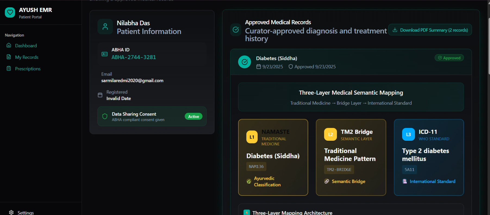
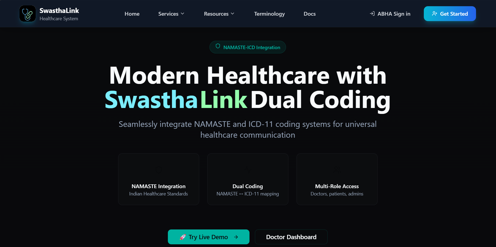

# 🏥 NAMASTE–ICD FHIR Terminology — README 

> **Project**: SIH25026\_Dual\_ — NAMASTE FHIR Terminology System (SIH 2025)

## 🎯 One‑line summary

Lightweight FHIR R4 terminology microservice that dual‑codes NAMASTE ↔ ICD‑11 (TM2 & Biomedicine) for AYUSH EMRs.

---

## ✨ Why this matters

- Bridges traditional AYUSH diagnoses (Ayurveda, Siddha, Unani) with global ICD‑11 coding.
- Enables interoperable, insurance‑ready patient records and real‑time morbidity analytics.
- Complies with India EHR 2016 requirements (FHIR R4, ABHA OAuth2, audit & consent metadata).

---

## 🔑 Core features (concise)

---

## 🎥 Product Demo

<div align="center">
  <a href="https://youtu.be/YKlkmNSDGuk" target="_blank">
    
  </a>
  <p><em>Click the image above to watch our product demo video</em></p>
</div>

### Key Highlights in the Demo
- 🔄 Real-time code mapping demonstration
- 👨‍⚕️ Doctor's workflow walkthrough
- 📊 Analytics and reporting features
- 🔍 Advanced search capabilities
- 🏥 EMR system integration

> **Note**: Replace `your_video_id` in the URL with your actual YouTube video ID, and add your video thumbnail as `video-thumbnail.png` in the docs/images directory.

---

## 📱 Application Pages

### 🏠 Home Page

<div align="center">
  
  <p><em>Homepage showcasing the NAMASTE-ICD dual coding system</em></p>
</div>

**Key Features:**
- Interactive hero section explaining the dual-coding system
- Quick access to search functionality
- Latest updates and statistics
- User authentication options

### 📊 EMR System Dashboard

<div align="center">
  
  <p><em>EMR System Dashboard for managing patient records and diagnoses</em></p>
</div>

**Features:**
- Patient record management
- Diagnosis entry with dual-coding support
- Real-time code mapping
- Historical record viewing
- Analytics and reporting

### 🔍 Terminology Page

<div align="center">
  
  <p><em>Comprehensive terminology mapping and search interface</em></p>
</div>

**Key Functions:**
- Advanced search for NAMASTE codes
- ICD-11 mapping visualization
- Hierarchical code browsing
- Detailed term information
- Export and import capabilities

### 👨‍⚕️ Doctor Dashboard

<div align="center">
  
  <p><em>Specialized interface for healthcare providers</em></p>
</div>

**Features:**
- Patient queue management
- Quick diagnosis entry
- Prescription management
- Treatment history
- Appointment scheduling

### 🔧 Curator Interface

<div align="center">
  
  <p><em>Advanced tools for terminology management</em></p>
</div>

**Capabilities:**
- Code mapping validation
- Term relationship management
- Quality assurance tools
- Audit trail viewing
- Bulk operations support

---


- FHIR R4 CodeSystem & ConceptMap resources (NAMASTE + ICD‑11)
- REST auto‑complete lookup, \$lookup, \$validate‑code, \$translate operations
- FHIR Bundle ingestion for double‑coded ProblemList entries
- ABHA OAuth2–ready authentication, role‑based access (patient, doctor, curator)
- Real‑time WHO ICD‑11 sync and semantic mapping with confidence scores
- Encrypted storage, audit trails, and versioning metadata

---

## 🏗 System architecture (diagram)

> The diagram below is a modern visual overview of how components interact. Use GitHub (Mermaid) or a Mermaid live editor to render it.

```mermaid
graph LR
  subgraph UserClients
    A[Patient UI] -->|uses| Frontend
    B[Doctor UI] -->|uses| Frontend
    C[Curator UI] -->|uses| Frontend
  end

  subgraph FrontendLayer
    Frontend[React TypeScript App]
  end

  subgraph Edge
    APIGW(API Gateway / Nginx)
    Auth[ABHA OAuth2 / Auth Service]
  end

  Frontend -->|HTTPS / REST| APIGW
  APIGW -->|Validate token| Auth

  subgraph Microservices
    TS(Terminology Service)
    FHIRS(FHIR Server / Persistence)
    Analytics(Analytics & Dashboard)
  end

  APIGW --> TS
  APIGW --> FHIRS
  TS -->|stores terms| MongoDB[(MongoDB)]
  TS -->|cache| Redis[(Redis Cache)]
  TS -->|sync| WHO[WHO ICD‑11 API]
  TS --> FHIRS
  FHIRS -->|stores bundles| MongoDB
  TS --> Analytics
  FHIRS --> Analytics
  CuratorUI -->|review/approve| TS

  %% Styling hints
  classDef orange fill:#1f2937,stroke:#7dd3fc,stroke-width:2px;color:#cfeff6;
  class Frontend,APIGW,Auth,TS,FHIRS,Analytics,MongoDB,Redis,WHO orange;
```




---

## ⚡ Quick start (trimmed)

1. Start the terminology service

```bash
cd Backend
node launch-terminology.js
```

Service available at `http://localhost:3001` (default)

2. Health & metadata checks

- `GET /health` — service health
- `GET /metadata` — FHIR CapabilityStatement
- `GET /stats` — basic usage metrics

3. Try key endpoints

- `GET /CodeSystem` — list CodeSystems
- `GET /ConceptMap` — list ConceptMaps
- `GET /CodeSystem/namaste-ayurveda/$lookup?code=NAM003` — code details
- `GET /ConceptMap/namaste-to-icd11-mms/$translate?code=NAM002` — translate

---

## 📦 Project structure (high level)

```
/Backend
  ├─ src/
  ├─ scripts/
  ├─ launch-terminology.js
  └─ data/ (NAMASTE CSV, snapshots)
/frontend
  ├─ src/
  └─ public/
/docs
  └─ api-docs.md
```

---

## ✅ Best practices & next steps

- Add ABHA OAuth2 sandbox integration for full authentication demo.
- Replace in‑memory datasets with production DB and secure secrets.
- Integrate WHO ICD‑11 live API with scheduled sync jobs and retry logic.
- Add CLI or Postman collection for testers.

---

## 📄 License & Contact

- License: MIT (update as needed)
- Contact: `support@swasthalink.org` or open an issue on the GitHub repo

---
